# Multistreaming using Nginx-RTMP

Instead of attempting to stream to multiple platforms all at once from your computer, a better idea is to:

- rent a server somewhere close to you
- configure and deploy an RTMP relay instance on that server
- livestream only to that relay server

A properly configured RTMP relay server can forward your livestream to as many destinations (streaming endpoints) as you want to.
This is what it looks like visually:

```mermaid
flowchart LR
    User["🎥 You (using OBS)"]

    Relay["rtmp://example.com:1935/relay"]

    Twitch["Twitch"]
    YouTube["YouTube"]
    Instagram["Instagram"]
    Kick["Kick"]

    User -->|RTMP| Relay

    Relay ----->|RTMP| Twitch
    Relay ----->|RTMP| YouTube
    Relay ----->|RTMP| Instagram
    Relay ----->|RTMP| Kick
```




## :rocket: Deployment

Edit `nginx.conf` replacing lines like these with exact RTMP endpoints given to you by each platform you plan on streaming to:

```nginx
push rtmp://a.rtmp.youtube.com/live2/STREAMKEY;
push rtmp://live-sea.twitch.tv/app/STREAMKEY;
```

Also, modify all the access rules to make sure only you can stream to this server.

```nginx
## lines like this
allow publish all;

## should be replaced with something like this
allow publish YOUR_IP_GOES_HERE;
deny publish all;
```

And then finally run this:

```shell
docker compose up -d
```

and that should be it!
